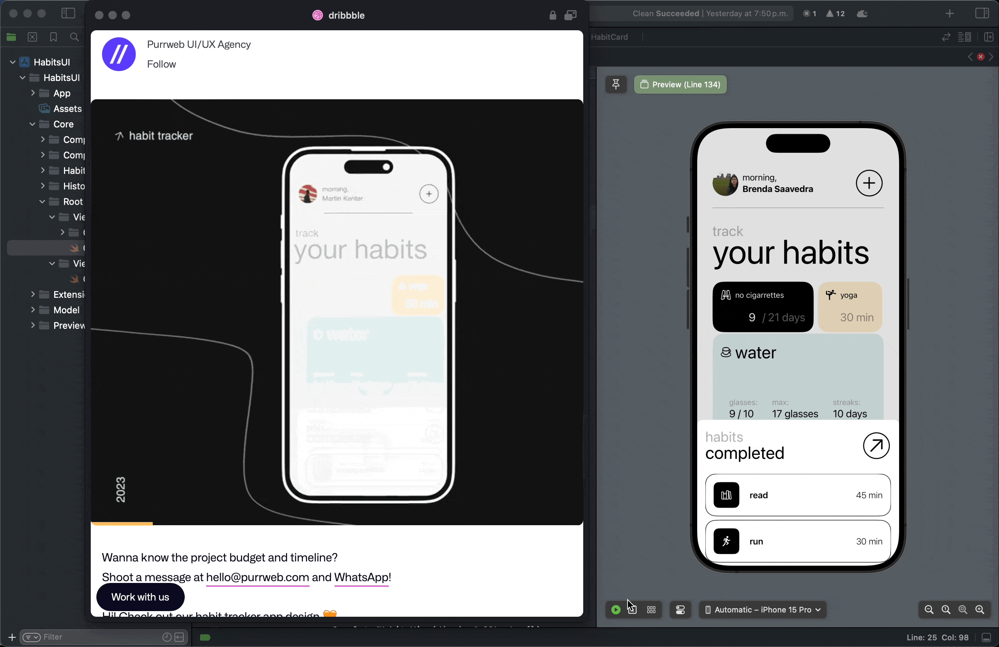

Habits BooksUI App - UI design 👋

Design App on SwiftUI from Dribbble [Habits Tracket App]([https://dribbble.com/shots/20954526-Habit-tracker-app))

 
  
     Habits Tracket App design with SwiftUI
      
  
  
  
   
     
    <a href="https://github.com/brsaca/HabitsUI/issues/new">Report bug</a>
    ·
    <a href="https://github.com/brsaca/HabitsUI/issues/new">Request feature</a>

## 📝 Description
Develop an app from a dribbble design in SwiftUI

## 👤 Author

**Brenda Saavedra**

- WebPage: [brendasaavedra.com](http://brendasaavedra.com)
- Github: [@brsaca](https://github.com/brsaca/)
